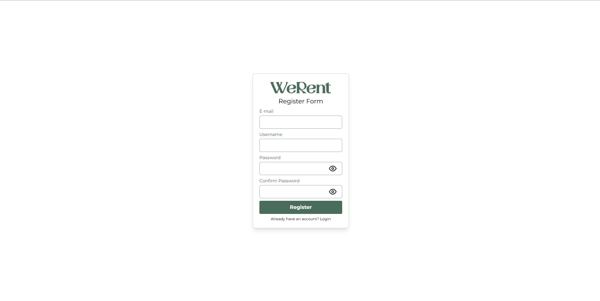
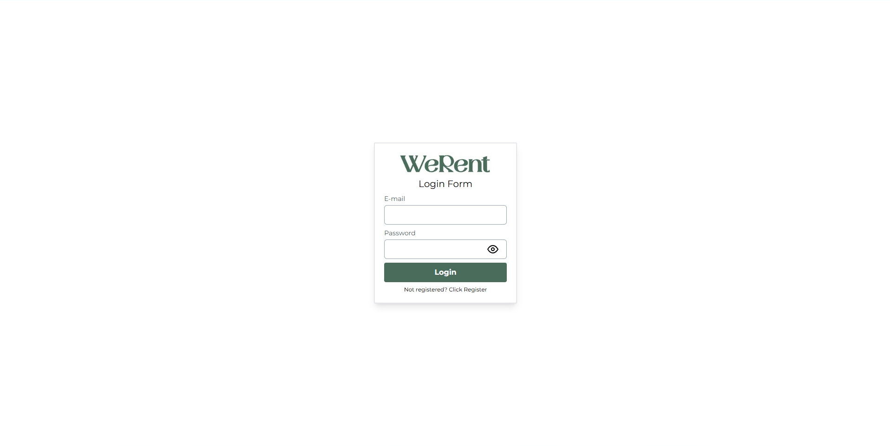
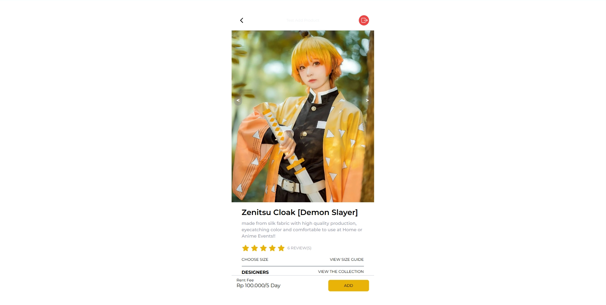
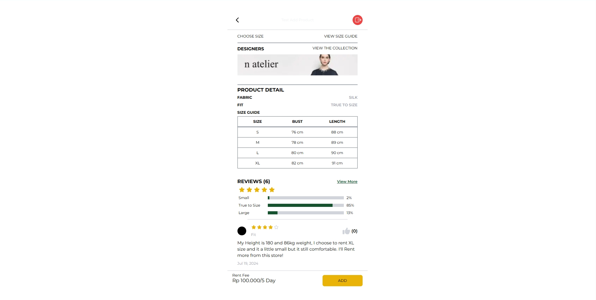
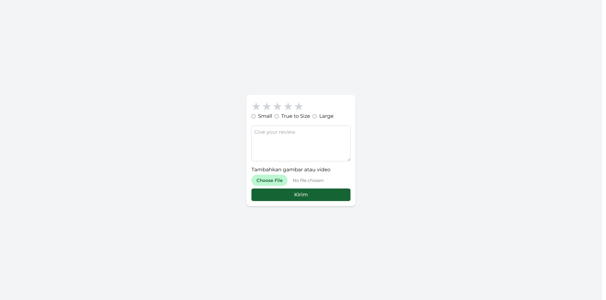
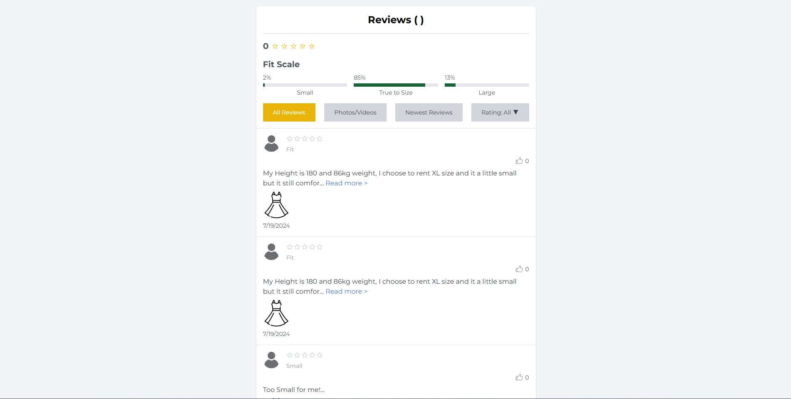
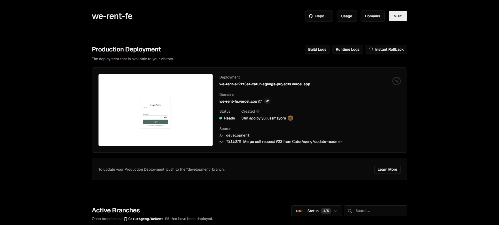

<h2 align="" id="top">  WeRent Project </h2>
WeRent is an application aimed at simplifying and improving the process of renting clothes. WeRent is designed for individuals looking to rent clothes, including young professionals, fashion students, social media influencers, event planners, and travelers. The platform caters to users who value transparency, reliability, and ease of use in the clothing rental process.

### Problem Statement

WeRent addresses issues such as complex user flows, unreliable product quality, inaccurate product descriptions, and difficulties in assessing the condition of rental items.

### :dart: Goals

By implementing a user-friendly review page, WeRent enhances transparency and user trust, allowing potential renters to make informed decisions based on the feedback and experiences of previous users.

## :file_folder: Folder Structure

```
|-- WeRent-FE/
|   ├── api/
|   ├── app/
|   ├── assets/
|   ├── config/
|   ├── features/
|   |       ├── add-product
|   |       ├── base
|   |       ├── home
|   |       ├── login
|   |       ├── product
|   |       ├── rate
|   |       ├── register
|   |       ├── review
|   |       └── index.ts
|   ├── provider/
|   └── public/
|-- README.md
```

## Installation

1. Clone the repository

```bash
git clone <repository_url>
```

2. Install Project Dependencies

```bash
$ npm install
```

## :checkered_flag: Usage/Examples

### Running the App:

```bash
# development
$ npm run start
```

## :rocket: Features

- Register
- Login
- Product
- Image Slide View
- Choose Size
- Like
- Choose Product
- Rating
- Review

## :book: Documentation

<h2 align="center"> Register</h2>



<h2 align="center">Login</h2>



<h2 align="center">Product</h2>



<h2 align="center">Product</h2>



<h2 align="center">Rating</h2>



<h2 align="center">Review</h2>



<h2 align="center">DEPLOYMENT</h2>

### This Project has been deploy using Vercel: [WeRent App](https://we-rent-fe.vercel.app/)



<a href="#top">Back to top</a>
